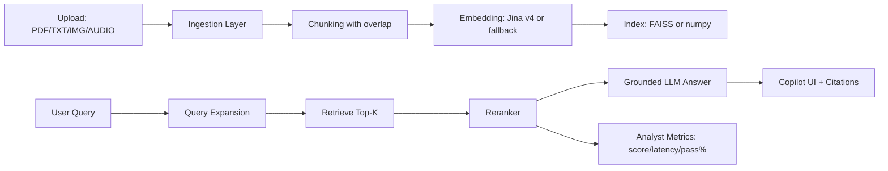

# Enterprise Copilot + Analyst Multimodal RAG

Multimodal RAG app with:
- PDF/TXT ingestion
- Image OCR + vision captioning
- Audio transcription
- Dense retrieval (Jina embeddings) + FAISS/numpy fallback
- Reranking (Jina reranker API + lexical fallback)
- Grounded generation + confidence guardrails
- Copilot Studio + Analyst Lab UI
- Persistent local index store (`.rag_store/`)

## Live Demo

`https://rag-groq-app-vzx48gfqckwgxgjribnqoc.streamlit.app/`

## Why This Is Beyond Baseline

1. Multimodal evidence pipeline (text/image/audio) with provenance.
2. Two-stage retrieval (dense retrieve + rerank) instead of single retrieval pass.
3. Analyst-grade observability: stage latency, retrieval quality, PASS/FAIL benchmark.
4. Confidence-aware refusal behavior for low-trust contexts.
5. Persistent index reload and structured benchmark/comparison exports.

## Architecture Diagram



## Exact Pipeline Steps

1. Ingest files (`rag/ingest.py`): PDF extract, TXT parse, image OCR+vision, audio ASR.
2. Chunk content (`rag/chunking.py`) with overlap.
3. Build embeddings (`rag/embeddings.py`) and index (`rag/retriever.py`).
4. Persist index to disk (`rag/store.py`).
5. Query-time: embed query, vector search, rerank (`rag/reranker.py`).
6. Generate grounded answer (`rag/llm.py`) with confidence scoring.
7. Display citations and diagnostics (`app.py`, `rag/eval.py`).

## Measurable Improvement (Before vs After)

Use Analyst Lab -> `Run Benchmark Pack` twice:
- once with baseline settings (label `baseline_rag`)
- once with improved/fine-tuned setup (label `fine_tuned_rag`)

Then use `Before vs After Comparison` table in app and export JSON.

| Metric | Baseline RAG | Fine-tuned/Improved | Delta |
|---|---:|---:|---:|
| Avg retrieval score | `fill from app` | `fill from app` | `after - baseline` |
| Avg confidence | `fill from app` | `fill from app` | `after - baseline` |
| Benchmark PASS % | `fill from app` | `fill from app` | `after - baseline` |
| Avg latency (ms) | `fill from app` | `fill from app` | `after - baseline` |

## Evaluator-Proof Artifacts (Checklist)

Capture and keep these files/screenshots:

1. Copilot answer + citations screenshot.
2. Analyst benchmark table screenshot.
3. Training summary/log screenshot (`training_summary.json` + console snippet).

Recommended artifact names:
- `artifacts/copilot_citations.png`
- `artifacts/analyst_benchmark.png`
- `artifacts/training_summary.png`

## Demo-Flawless Checklist (Before Evaluation)

- App link opens without runtime error.
- Streamlit secrets set:
  - `GROQ_API_KEY`
  - `JINA_API_KEY`
- Input smoke tests completed:
  - PDF upload
  - TXT upload
  - Image upload
  - Audio upload
- Benchmark pack executes successfully.
- Latest benchmark JSON exported.

## Form / Viva Ready Answers

- Embedding model used:
  - `jina-embeddings-v4` (semantic retrieval quality; robust for multimodal extracted text).
- Did you observe latency:
  - Yes, stage-wise latency tracked (ingest/index, query embed, search, rerank, generation).
- GPT-2 padding token present:
  - No default padding token.
- Epochs trained:
  - Use real `epochs` from `finetune_outputs/.../training_summary.json`.

## Setup

### Runtime

```bash
pip install -r requirements.txt
streamlit run app.py
```

### Tests

```bash
pip install -r requirements-dev.txt
pytest -q
```

### Fine-Tuning Pipeline

```bash
pip install -r requirements-finetune.txt
python finetune/train_lora.py --train_file finetune/data/sample_train.jsonl --base_model sshleifer/tiny-gpt2 --output_dir finetune_outputs/tinygpt2-lora --epochs 1 --batch_size 1 --lr 2e-4
```

Read:
- `finetune_outputs/tinygpt2-lora/training_summary.json`

## Required Secrets

```toml
GROQ_API_KEY = "your_groq_key"
JINA_API_KEY = "your_jina_key"
```
